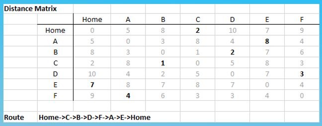
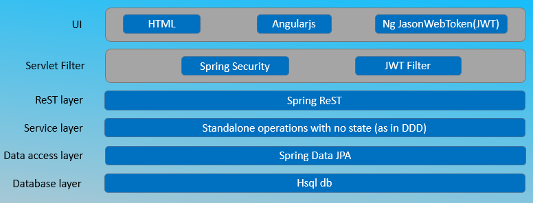
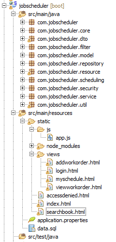

# jobscheduler
A demo web application deployable on cloud using spring boot, angularjs, spring, hsql, jwt and gradle
***
**Problem Statement**: Service N job orders using M technicians optimally under a set of constraints

**Solution**: Simple algorithm to solve travelling salesman problem (TSP) 

***
**Technology Stack** 
* Spring Boot 
* Spring Security 
* Spring ReST 
* Spring Data JPA 
* Cloud foundry 
* Gradle 
* Hsql 
* Angularjs 
* Json web token (jjwt & angular-jwt)

***

**Layered Architecture** 

***  
**Database Design**: RDBMS used as data is structured and simple
  Tables: User, WorkOrder, Skill
***
**Deployment strategy**: Deployed on Cloud Foundry using Spring tool suite along with gradle. 
***
**Demo URL**: http://jobscheduler.cfapps.io/#/login
***
**ReST APIs**
* authenticate(UserDTO) – /jobscheduler/ authenticate – HTTP Post
* addWorkOrder(WorkOrderDTO) – /jobscheduler/ workorder - HTTP Post
* readAvailableSkills() – /jobscheduler/skills - HTTP Get
* retrieveScheduleForTechnician(String) – /jobscheduler/myschedule/{username} - HTTP Get
* viewOrders() – /jobscheduler/vieworders - HTTP Get

***

**UI Artifacts**
* Login page (for public)
* My schedule page (for technician)
* View Orders (for customer care)
* Add work order (for customer care)

***
**Source code packages**

